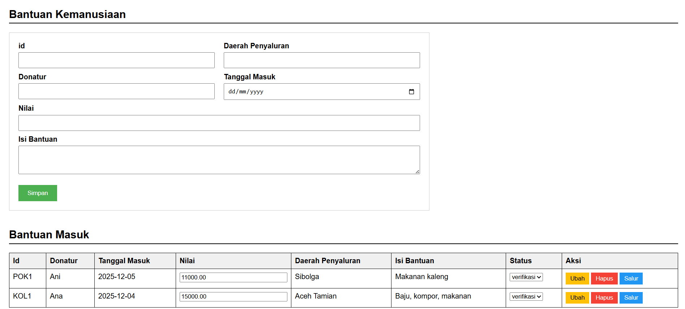
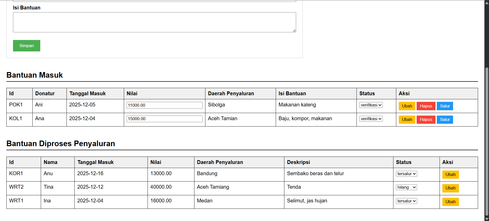
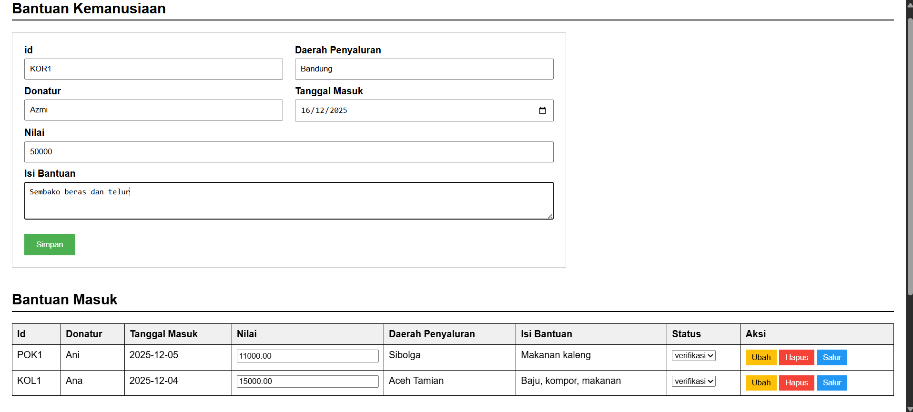
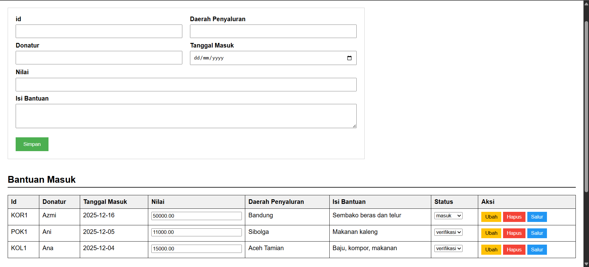
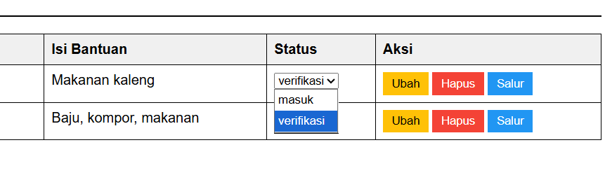
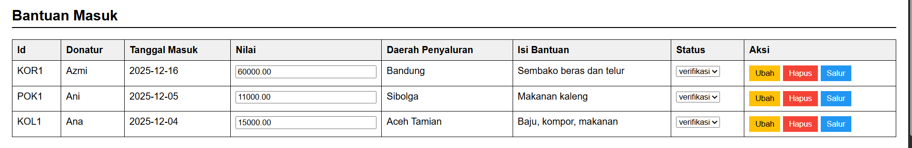
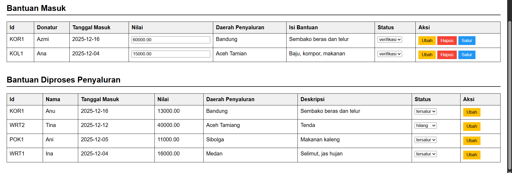

## I. JANJI

Saya **Muhammad 'Azmi Salam** dengan NIM **2406010** mengerjakan soal **UAS** dalam mata kuliah **Desain Pemrograman Berorientasi Objek** untuk keberkahanNya maka saya tidak melakukan kecurangan seperti yang telah dispesifikasikan. Aamiin.


## II. PENJELASAN DESAIN DAN ARSITEKTUR (MVP)

Sistem ini dikembangkan menggunakan bahasa pemrograman **PHP Native** dengan menerapkan pola arsitektur perangkat lunak **Model-View-Presenter (MVP)**. Pemilihan arsitektur ini bertujuan untuk memisahkan logika bisnis (Model), logika tampilan (View), dan penghubung keduanya (Presenter) agar kode menjadi terstruktur, mudah dikelola, dan modular.

### Struktur Direktori

```text
UASDPBOAzmiC2/
├── Dokumentasi/
│   ├── 1.png
│   ├── 2.png
│   ├── 3.png
│   ├── 4.png
│   ├── 5.png
│   ├── 6.png
│   ├── 7.png
│   └── 8.png
│
├── config/
│   └── Database.php
├── model/
│   └── AssistanceModel.php
├── presenter/
│   └── AssistancePresenter.php
│
├── index.php
├── dbantuan.sql
├── UAS DPBO - Muhammad 'Azmi.pdf
└── README.md
````

### Rincian Komponen MVP

#### 1\. Model (Data Logic)

Komponen ini bertanggung jawab penuh atas manipulasi data dan komunikasi langsung dengan basis data (`dbantuan`). Model tidak memiliki akses langsung ke antarmuka pengguna.

  * **File:** `model/AssistanceModel.php`
  * **Fungsi Utama:** Melakukan operasi *Create, Read, Update, Delete* (CRUD) serta menangani transaksi basis data untuk pemindahan data dari tabel masuk ke tabel salur.

#### 2\. View (User Interface)

Komponen ini adalah antarmuka yang dilihat oleh pengguna. View hanya bertugas menampilkan data dan menerima input pengguna, tanpa mengandung logika bisnis yang kompleks.

  * **File:** `index.php`
  * **Fungsi Utama:** Menampilkan formulir input bantuan, tabel daftar bantuan masuk, dan tabel daftar bantuan tersalur sesuai dengan spesifikasi visual soal (mockup).

#### 3\. Presenter (Business Logic & Bridge)

Komponen ini bertindak sebagai perantara. Presenter menerima input dari View, memproses permintaan tersebut, memerintahkan Model untuk mengambil atau mengubah data, lalu mengembalikan hasilnya ke View.

  * **File:** `presenter/AssistancePresenter.php`
  * **Fungsi Utama:** Menangani logika tombol "Simpan", "Ubah", "Hapus", dan "Salur", serta mengatur aliran data agar View selalu menampilkan informasi terbaru.

### Diagram Alur MVP

> **View** (Input User) → **Presenter** (Handle Request) → **Model** (Query SQL) → **Database**
>
> **Database** → **Model** (Return Data) → **Presenter** (Pass Data) → **View** (Display HTML)


## III. STRUKTUR BASIS DATA

Sesuai dengan instruksi soal, basis data yang digunakan bernama `dbantuan` dengan dua tabel utama yang memiliki struktur identik.

### 1\. Tabel `tbantuanmasuk`

Menyimpan data bantuan yang baru diterima atau sedang dalam proses verifikasi.

  * `id` (VARCHAR 20, PK): Kode unik bantuan.
  * `donatur` (VARCHAR 100): Nama penyumbang.
  * `isibantuan` (TEXT): Rincian barang bantuan.
  * `tanggalmasuk` (DATE): Tanggal penerimaan.
  * `nilai` (DECIMAL 15,2): Estimasi nilai bantuan.
  * `daerahsalur` (VARCHAR 100): Rencana lokasi penyaluran.
  * `status` (VARCHAR 20): Default 'masuk' (opsi lain: 'verifikasi').

### 2\. Tabel `tbantuansalur`

Menyimpan data bantuan yang telah diproses dan disalurkan ke lokasi tujuan.

  * `id` (VARCHAR 20, PK): Kode unik bantuan (tetap sama).
  * *Kolom lainnya sama persis dengan tabel `tbantuanmasuk`.*
  * `status` (VARCHAR 20): Default 'tersalur' (opsi lain: 'hilang').


## IV. FITUR DAN JALANNYA KODE PROGRAM

Berikut adalah penjelasan mengenai fitur-fitur yang berhasil diimplementasikan dan alur kerjanya:

### 1\. Input Data Bantuan Baru

  * **Fitur:** Pengguna dapat memasukkan data bantuan baru melalui formulir di bagian atas halaman.
  * **Alur:** Pengguna mengisi formulir dan menekan tombol "Simpan". Presenter menerima data, memanggil `addAssistance` di Model, dan Model menyimpannya ke `tbantuanmasuk` dengan status default 'masuk'.

### 2\. Edit Inline (Bantuan Masuk)

  * **Fitur:** Pengguna dapat mengubah Nilai dan Status (menjadi 'verifikasi') langsung pada baris tabel Bantuan Masuk.
  * **Alur:** Pengguna mengedit kolom input pada tabel, lalu menekan tombol "Ubah". Sistem akan memperbarui data spesifik tersebut di `tbantuanmasuk` tanpa memengaruhi kolom lain.

### 3\. Penyaluran Bantuan (Tombol Salur)

  * **Fitur:** Memindahkan data dari tabel Bantuan Masuk ke Bantuan Tersalur.
  * **Alur:** Ketika tombol "Salur" ditekan:
    1.  Model memulai transaksi basis data.
    2.  Data disalin (*INSERT*) ke tabel `tbantuansalur` dengan status otomatis diubah menjadi 'tersalur'.
    3.  Data asal dihapus (*DELETE*) dari tabel `tbantuanmasuk`.
    4.  Jika proses sukses, transaksi di-*commit*.

### 4\. Update Status Distribusi

  * **Fitur:** Pengguna dapat mengubah status bantuan yang sudah disalurkan menjadi 'hilang' jika terjadi kendala.
  * **Alur:** Pada tabel bawah (Bantuan Diproses Penyaluran), pengguna mengubah dropdown status dan menekan tombol "Ubah".

### 5\. Hapus Data

  * **Fitur:** Menghapus data bantuan yang tidak valid dari sistem.
  * **Alur:** Menekan tombol "Hapus" akan memerintahkan Model untuk menghapus baris data permanen dari basis data.


## V. SCREENSHOT HASIL EKSEKUSI

### Gambar 1: Tampilan Awal




### Gambar 2: Proses Input Data Baru




### Gambar 3: Proses Ubah Data




### Gambar 4: Hasil Setelah Tombol "Salur" Ditekan



### Gambar 5: Hasil Setelah Tombol "Hapus" Ditekan

